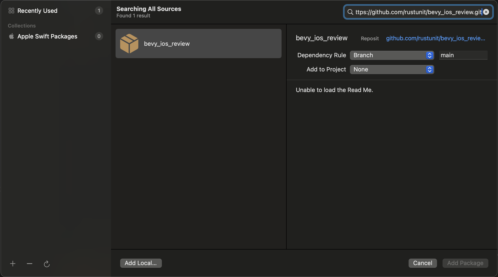

# bevy_ios_gamecenter

[](https://crates.io/crates/bevy_ios_gamecenter)

Bevy Plugin and Swift Package to provide access to iOS native GameKit (Gamecenter) from inside Bevy Apps
It uses [Swift-Bridge](https://github.com/chinedufn/swift-bridge) to auto-generate the glue code and transport datatypes.


See also [bevy_ios_iap](https://github.com/rustunit/bevy_ios_iap), [bevy_ios_notifications](https://github.com/rustunit/bevy_ios_notifications), [bevy_ios_alerts](https://github.com/rustunit/bevy_ios_alerts) & [bevy_ios_impact](https://github.com/rustunit/bevy_ios_impact)

## Instructions

1. Add to XCode: Add SPM (Swift Package Manager) dependency
2. Add Rust dependency
3. Setup Plugin

### 1. Add to XCode

Go to `File` -> `Add Package Dependencies` and paste `https://github.com/rustunit/bevy_ios_gamecenter.git` into the search bar on the top right:


### 2. Add Rust dependency

```
cargo add bevy_ios_gamecenter
``` 

or 

```
bevy_ios_gamecenter = { version = "0.1" }
```

### 3. Setup Plugin

Initialize Bevy Plugin:

```rust
// request auth right on startup
app.add_plugins(IosGamecenterPlugin::new(true));
```