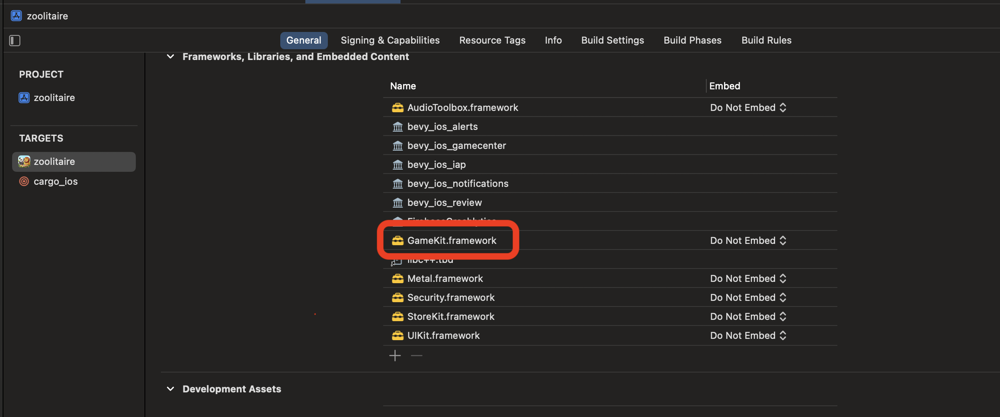

# bevy_ios_gamecenter

[![crates.io][sh_crates]][lk_crates]
[![docs.rs][sh_docs]][lk_docs]
[![discord][sh_discord]][lk_discord]

[sh_crates]: https://img.shields.io/crates/v/bevy_ios_gamecenter.svg
[lk_crates]: https://crates.io/crates/bevy_ios_gamecenter
[sh_docs]: https://img.shields.io/docsrs/bevy_ios_gamecenter
[lk_docs]: https://docs.rs/bevy_ios_iap/latest/bevy_ios_gamecenter/
[sh_discord]: https://img.shields.io/discord/1176858176897953872?label=discord&color=5561E6
[lk_discord]: https://discord.gg/rQNeEnMhus

Bevy Plugin and Swift Package to provide access to iOS native GameKit (Gamecenter) from inside Bevy Apps
It uses [Swift-Bridge](https://github.com/chinedufn/swift-bridge) to auto-generate the glue code and transport data types.


> Demo from our game using this crate: [zoolitaire.com](https://zoolitaire.com)

See also [bevy_ios_iap](https://github.com/rustunit/bevy_ios_iap), [bevy_ios_notifications](https://github.com/rustunit/bevy_ios_notifications), [bevy_ios_alerts](https://github.com/rustunit/bevy_ios_alerts), [bevy_ios_review](https://github.com/rustunit/bevy_ios_review) & [bevy_ios_impact](https://github.com/rustunit/bevy_ios_impact)

## Features
* authentication
* save games (based on iCloud)
* achievements
* leaderboards

## TODOs
* challenges, matchmaking

## Instructions

1. Add to XCode: Add SPM (Swift Package Manager) dependency
2. Add Rust dependency
3. Setup Plugin

### 1. Add to XCode

* Add `GameKit` framework:


* Go to `File` -> `Add Package Dependencies` and paste `https://github.com/rustunit/bevy_ios_gamecenter.git` into the search bar on the top right:


**Note:** 
The rust crate used must be exactly the same version as the Swift Package.
I suggest using a specific version (like `0.2.0` in the screenshot) to make sure to always use binary matching versions!


### 2. Add Rust dependency

```
cargo add bevy_ios_gamecenter
``` 

or 

```toml
# always pin to the same exact version you also of the Swift package
bevy_ios_gamecenter = { version = "=0.2.0" }
```

### 3. Setup Plugin

Initialize Bevy Plugin:

```rust
// request auth right on startup
app.add_plugins(IosGamecenterPlugin::new(true));
```

```rust
fn bevy_system() {
    bevy_ios_gamecenter::achievements_reset();
    
    // update achievement progress, 100 % will complete it
    bevy_ios_gamecenter::achievement_progress("id".into(),100.);

    bevy_ios_gamecenter::leaderboards_score(
        "raking id".into(),
        // score
        1,
        // context
        2,
    );

    // open gamecenter view (leaderboard)
    bevy_ios_gamecenter::trigger_view(view_states::LEADERBOARDS);

    // save arbitrary binary buffer as a savegame
    bevy_ios_gamecenter::save_game("test".into(), vec![1, 2, 3].as_slice());

    // request list of `IosGCSaveGame`
    bevy_ios_gamecenter::fetch_save_games();

    // based on result of above `fetch_save_games` request
    let save_game = IosGCSaveGame {..} 
    bevy_ios_gamecenter::load_game(save_game);
}
```

Alternatively you can use a convenient `Observer` based request/response approach:

```rust
fn bevy_system(mut gamecenter: BevyIosGamecenter) {
    gamecenter.fetch_save_games().on_response(|trigger:Trigger<IosGCSaveGamesResponse>|{
        // handle list of save games
    });
}
```

Process Response Events from iOS back to us in Rust:

```rust
fn process_gamecenter_events(
    mut events: EventReader<IosGamecenterEvents>,
) {
    for e in events.read() {
        match e {
            IosGamecenterEvents::SaveGames(response) => todo!(),
            IosGamecenterEvents::Player(player) => todo!(),
            IosGamecenterEvents::Authentication(response) => todo!(),
            IosGamecenterEvents::SavedGame(response) => todo!(),
            IosGamecenterEvents::LoadGame(response) => todo!(),
            IosGamecenterEvents::AchievementProgress(response) => todo!(),
            IosGamecenterEvents::AchievementsReset(response) => todo!(),
            IosGamecenterEvents::LeaderboardScoreSubmitted(response) => todo!(),
        }
    }
}
```

## Bevy version support

|bevy|bevy\_ios\_gamecenter|
|----|---|
|0.14|0.2,main|
|0.13|0.1|

# License

All code in this repository is dual-licensed under either:

- MIT License (LICENSE-MIT or http://opensource.org/licenses/MIT)
- Apache License, Version 2.0 (LICENSE-APACHE or http://www.apache.org/licenses/LICENSE-2.0)

at your option. This means you can select the license you prefer.

## Your contributions
Unless you explicitly state otherwise, any contribution intentionally submitted for inclusion in the work by you, as defined in the Apache-2.0 license, shall be dual licensed as above, without any additional terms or conditions.
